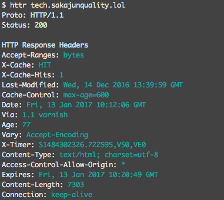

httr (HTTp Response)
=================================

Overview
------------
Command line tool for displaying HTTP response headers.




Installation
------------
#### Using homebrew,
```
$ brew tap sakajunquality/homebrew-quality
$ brew install httr
```

#### Using go get,
```
$ go get github.com/codegangsta/cli
$ go get github.com/fatih/color
$ go get github.com/sakajunquality/httr
```


Usage
------------
```
$ httr example.com
$ httr https://example.com
$ httr https://example.com:443
```


## Future Perspectives

- make it cool
- add testing
- methods other than GET
- custom request header / body
- option for displaying response body


Contributing
-----
Always welcome for contributing


License & Authors
-----------------
- Author:: @sakajunquality
- License:: MIT